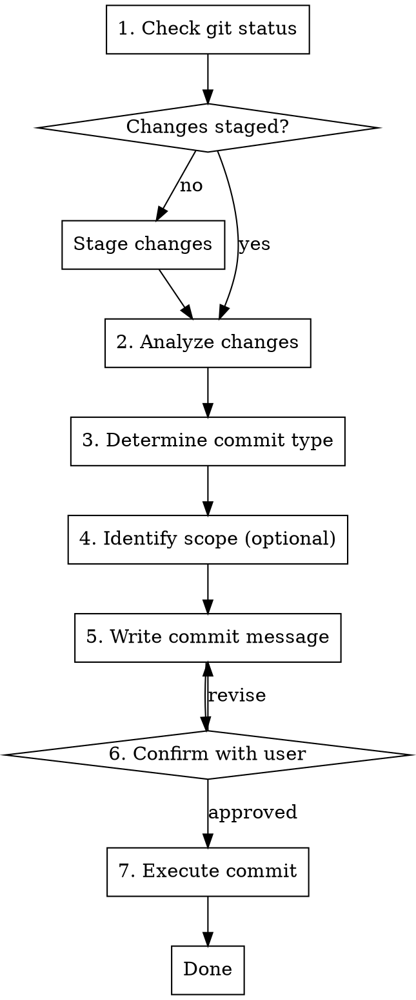

# Semantic Commit

Create git commits following the [Conventional Commits](https://www.conventionalcommits.org/) specification for consistent, machine-readable commit history.

## Workflow



## Commit Types

| Type | Description | Example |
|------|-------------|---------|
| `feat` | A new feature | `feat: add user authentication` |
| `fix` | A bug fix | `fix: resolve null pointer in login` |
| `docs` | Documentation only | `docs: update API reference` |
| `style` | Formatting, no code change | `style: fix indentation in utils` |
| `refactor` | Code change, no new feature or fix | `refactor: extract validation logic` |
| `perf` | Performance improvement | `perf: optimize database queries` |
| `test` | Adding or fixing tests | `test: add unit tests for auth` |
| `build` | Build system or dependencies | `build: upgrade webpack to v5` |
| `ci` | CI configuration | `ci: add GitHub Actions workflow` |
| `chore` | Maintenance tasks | `chore: update dependencies` |
| `revert` | Reverts a previous commit | `revert: undo feature flag change` |

## Commit Message Format

```
<type>[optional scope][!]: <description>

[optional body]

[optional footer(s)]
```

### Components

- **type**: Required. One of the types above
- **scope**: Optional. Section of codebase in parentheses: `feat(api):`, `fix(auth):`
- **!**: Optional. Indicates breaking change: `feat!:` or `feat(api)!:`
- **description**: Required. Imperative mood, lowercase, no period
- **body**: Optional. Explains "why" not "what", wrapped at 72 chars
- **footer**: Optional. `BREAKING CHANGE:`, `Fixes #123`, `Co-authored-by:`

## Step-by-Step Process

### 1. Check Current State

Run git status to see staged and unstaged changes:
```bash
git status
git diff --cached --stat  # staged changes
git diff --stat           # unstaged changes
```

### 2. Stage Changes (if needed)

If no changes are staged, ask the user which files to stage:
```bash
git add <files>           # specific files
git add -p                # interactive staging
git add .                 # all changes (use carefully)
```

### 3. Analyze Changes

Review the staged diff to understand what changed:
```bash
git diff --cached
```

Identify:
- What files were modified
- What functionality was added/changed/removed
- Whether this is a feature, fix, refactor, etc.

### 4. Determine Commit Type

Based on the analysis:
- New functionality → `feat`
- Bug fix → `fix`
- Code restructuring without behavior change → `refactor`
- Performance optimization → `perf`
- Test additions/changes → `test`
- Documentation → `docs`
- Formatting only → `style`
- Dependencies/build → `build` or `chore`

### 5. Write Commit Message

Guidelines:
- Use imperative mood: "add" not "added" or "adds"
- Keep subject line under 50 characters
- Don't end subject with period
- Separate subject from body with blank line
- Wrap body at 72 characters
- Explain "why" in body, not "what" (the diff shows what)

### 6. Confirm with User

Present the proposed commit message and ask for confirmation before executing.

### 7. Execute Commit

```bash
git commit -m "$(cat <<'EOF'
<type>(<scope>): <description>

<body if needed>
EOF
)"
```

## Examples

### Simple Feature
```
feat: add password strength indicator
```

### Feature with Scope
```
feat(auth): add OAuth2 support for Google login
```

### Bug Fix with Issue Reference
```
fix(api): handle empty response from payment gateway

The payment API occasionally returns empty responses during
high load. Added retry logic with exponential backoff.

Fixes #234
```

### Breaking Change
```
feat(api)!: change authentication to use JWT tokens

BREAKING CHANGE: API now requires Bearer token authentication.
Session-based auth is no longer supported. See migration guide
in docs/auth-migration.md.
```

### Refactor
```
refactor(database): extract query builder into separate module

Improves testability and reduces coupling between the ORM
and business logic layers.
```

## Common Mistakes

| Mistake | Correct Approach |
|---------|------------------|
| `feat: Added new feature` | `feat: add new feature` (imperative mood) |
| `fix: Fix bug.` | `fix: resolve null pointer in parser` (no period, be specific) |
| `update code` | `refactor(utils): simplify date formatting logic` (include type) |
| Subject line > 72 chars | Keep under 50, use body for details |
| `feat: misc changes` | One commit per logical change |

## Integration with Git Workflow

After committing:
- Run `git log --oneline -5` to verify the commit
- Consider if changes should be pushed: `git push`
- For PRs, ensure commit messages align with PR description
